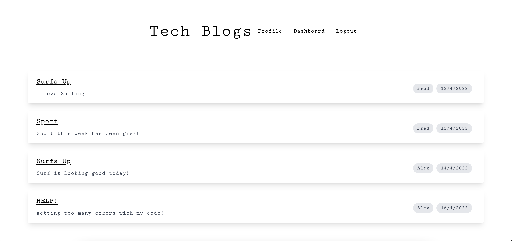
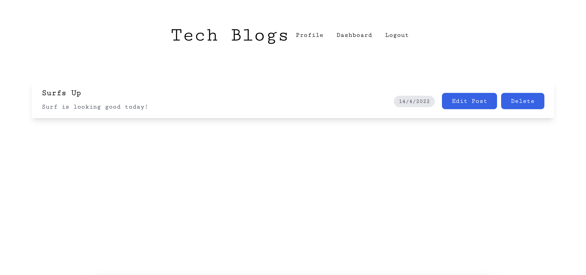
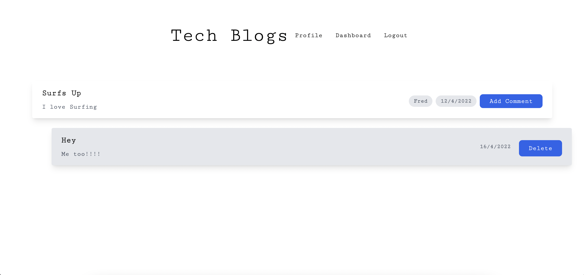

# Week14-Homework

# Tech Blog

## Description 

This is a simple application to add and comment on projects.
Users can register and account and then view what other users have posted about and with the added option to also comment on other users posts.
Posts and comments can be deleted with a user also being able to edit their posts from the profile page.


## Table of contents 

- [Screenshots](#screenshots) 
- [Technologies](#technologies) 
- [Installation](#installation)
- [Resources](#resources) 
- [Contact](#contact)
  
## Screenshots 
---

*Homepage*



*Profile*



*Dashboard*



## Technologies
***
A list of technologies used within the project:

- Javascript
- GIT
- MySQL
- Sequalize
- Express.js
- Node.js
- Dotenv
- Handlebars.js
- session
- bcrypt

## Installation
***
To install and use this app please run the below in your CLI.
```
$ cd /Users/chaz/Bootcamp/week13/tech-blog/server.js
$ npm install
$ npm start
```
Note: This application is only a partial app and it can be tested using Insomnia.

## Resources

[Github Repo](https://github.com/mckayjalex/tech-blog)

[Live Site](https://shrouded-river-38098.herokuapp.com/)

## Contact

GitHub: [GitHub](https://github.com/mckayjalex) Email: [alexjosephmckay@gmail.com](alexjosephmckay@gmail.com)
